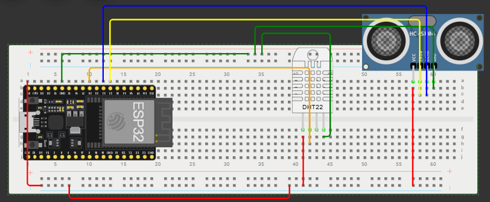
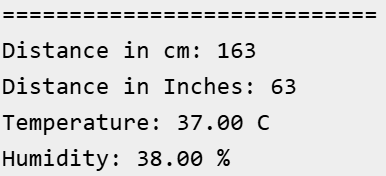

# PERTEMUAN 6 - DHT & ULTRASONIK

Pada pertemuan ini melanjutkan pertemuan kemarin dengan menambahkan salah satu sensor yaitu hc-sr04 (sensor ultrasonic). Sehingga alat yang digunakan pada praktikum ini adalah:

- **Bread Board**
- **DHT11 Sensor**
- **HC-SR04 Sensor**

Desain dibuat menggunakan  sebelum implementasi sungguhan untuk meminimalisir terjadinya kongslet pada alat. Hasil yang diharapkan dari sensor-sensor yang dipasang adalah deteksi suhu dan kelembaban sebuah ruangan serta dapat mendeteksi jarak terhadap suatu benda di depan sensor ultrasonik, desain rangkaian yang dibuat dapat dilihat pada hasil.

## Hasil

### Gambar

- Rangkaian pada wokwi
  

- Hasil dari rangkaian wokwi
  

### Code

```c
#include <Wire.h>
#include "DHT.h"


#define DHTPIN 26
#define DHTTYPE DHT22
DHT dht(DHTPIN, DHTTYPE);

#define PIN_TRIG 32
#define PIN_ECHO 33

int prevDistanceCm = -1;
int prevDistanceInches = -1;
float prevTemperature = -1;
float prevHumidity = -1;

void valueIfChanged(int distanceCm, int distanceInches, float temperature, float humidity){
  bool hasChanged = false;

  if (distanceCm != prevDistanceCm){
    prevDistanceCm = distanceCm;
    hasChanged = true;
  }
  if (distanceInches != prevDistanceInches){
    prevDistanceInches = distanceInches;
    hasChanged = true;
  }
  if (temperature != prevTemperature){
    prevTemperature = temperature;
    hasChanged = true;
  }
  if (humidity != prevHumidity){
    prevHumidity = humidity;
    hasChanged = true;
  }

  if (hasChanged){
  Serial.println("============================");
  Serial.print("Distance in cm: ");
  Serial.println(distanceCm);
  Serial.print("Distance in Inches: ");
  Serial.println(distanceInches);
  Serial.print("Temperature: ");
  Serial.print(temperature);
  Serial.println(" C");
  Serial.print("Humidity: ");
  Serial.print(humidity);
  Serial.println(" %");
  }
}

void setup() {
  Serial.begin(115200);
  Serial.println("ESP32 DHT22 and ULTRASONIC SENSOR");
  pinMode(PIN_TRIG, OUTPUT);
  pinMode(PIN_ECHO, INPUT);
  dht.begin();
}

void loop() {
  digitalWrite(PIN_TRIG, HIGH);
  delayMicroseconds(10);
  digitalWrite(PIN_TRIG, LOW);

  int duration = pulseIn(PIN_ECHO, HIGH);
  int distanceCm = duration / 58;
  int distanceInches = duration / 148;

  //DHT attributes & serial print
  float humidity = dht.readHumidity();
  float temperature = dht.readTemperature();

  valueIfChanged(distanceCm, distanceInches, temperature, humidity);
  delay(100);
}
```

> Pendefinisian PIN perlu diperhatikan saat implementasi dengan sensor sungguhan untuk meminimalisir potensi konslet pada alat.
